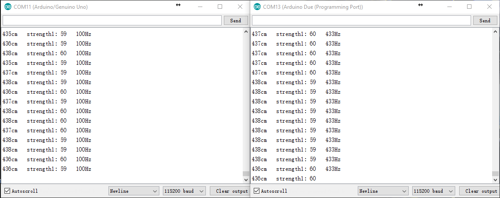

# TFmini-Arduino
TFmini在Arduino上的一些例子: 

* [TFmini_Arduino_HardwareSerial_Polling](#tfmini_arduino_hardwareserial_polling)
* [TFmini_Arduino_HardwareSerial_Interrupt](#tfmini_arduino_hardwareserial_interrupt)  
* [TFmini_Arduino_SoftwareSerial](#tfmini_arduino_softwareserial)
* [TFmini_Arduino_SoftwareSerial_Multiple](#tfmini_arduino_softwareserial_multiple)
* [TFmini_Arduino_SoftwareSerial_Multiple_Frequency](#tfmini_arduino_softwareserial_multiple_frequency)
* [TFmini_Arduino_I2C_1Master1Slave](#tfmini_arduino_i2c_1master1slave)


---    

## TFmini_Arduino_HardwareSerial_Polling  
类似于Arduino Uno, 只有一个串口的Arduino板子, 并不妨碍我们读取TFmini的数据, 只需要连接TFmini的TX到Arduino的RX即可, 不影响Arduino的TX向PC发数据, 连接方式如下:  

  


TFmini | Arduino 
---------|----------
 5V(红) | 5V 
 GND(黑) | GND 
 TX(绿) | 0(RX)

采用轮询的方式, 代码如下:  

```Arduino
void getTFminiData(int* distance, int* strength) {
  static char i = 0;
  char j = 0;
  int checksum = 0; 
  static int rx[9];
  if(Serial.available()) {  
    rx[i] = Serial.read();
    if(rx[0] != 0x59) {
      i = 0;
    } else if(i == 1 && rx[1] != 0x59) {
      i = 0;
    } else if(i == 8) {
      for(j = 0; j < 8; j++) {
        checksum += rx[j];
      }
      if(rx[8] == (checksum % 256)) {
        *distance = rx[2] + rx[3] * 256;
        *strength = rx[4] + rx[5] * 256;
      }
      i = 0;
    } else {
      i++;
    } 
  }  
}

void setup() {
  Serial.begin(115200);
}

void loop() {
  int distance = 0;
  int strength = 0;

  getTFminiData(&distance, &strength);
  while(!distance) {
    getTFminiData(&distance, &strength);
    if(distance) {
      Serial.print(distance);
      Serial.print("cm\t");
      Serial.print("strength: ");
      Serial.println(strength);
    }
  }
}
```  

**注意下载程序的时候, 拔掉TFmini的TX, 下完程序后再插到Arduino的0(RX)上.**


## TFmini_Arduino_HardwareSerial_Interrupt  

连接方式同上, 我们在串口时间中接收, 接收完成后, 在loop()中打印:  

```Arduino
int distance = 0;
int strength = 0;
boolean receiveComplete = false;

void getTFminiData(int* distance, int* strength, boolean* complete) {
  static char i = 0;
  char j = 0;
  int checksum = 0; 
  static int rx[9];
  if(Serial.available()) {  
    rx[i] = Serial.read();
    if(rx[0] != 0x59) {
      i = 0;
    } else if(i == 1 && rx[1] != 0x59) {
      i = 0;
    } else if(i == 8) {
      for(j = 0; j < 8; j++) {
        checksum += rx[j];
      }
      if(rx[8] == (checksum % 256)) {
        *distance = rx[2] + rx[3] * 256;
        *strength = rx[4] + rx[5] * 256;
        *complete = true;
      }
      i = 0;
    } else {
      i++;
    } 
  }  
}

void setup() {
  Serial.begin(115200);
}

void loop() {
  if(receiveComplete) {
    receiveComplete = false;
    Serial.print(distance);
    Serial.print("cm\t");
    Serial.print("strength: ");
    Serial.println(strength);
  }
}

void serialEvent() {
  getTFminiData(&distance, &strength, &receiveComplete);
}
```

**注意下载程序的时候, 拔掉TFmini的TX, 下完程序后再插到Arduino的0(RX)上.**  


## TFmini_Arduino_SoftwareSerial  

使用软件串口库, 来模拟一个串口. 连接方式如下:  


代码参考 [TFmini_Arduino_SoftwareSerial](/TFmini_Arduino_SoftwareSerial). 

下载程序, 运行即可.  


## TFmini_Arduino_SoftwareSerial_Multiple  
listen轮询软件串口的方法, 连接多个TFmini, 只需要接TFmini的TX即可, RX悬空, 理论上几乎未被占用的数字IO每个都可以接一个TFmini.  

  

代码参考 [TFmini_Arduino_SoftwareSerial_Multiple](/TFmini_Arduino_SoftwareSerial_Multiple). 


## TFmini_Arduino_SoftwareSerial_Multiple_Frequency
listen轮询软件串口的方法, 连接多个TFmini, 只需要接TFmini的TX即可, RX悬空, 理论上几乎未被占用的数字IO每个都可以接一个TFmini. 对上面的代码优化, 封装, 并且加上测试频率: 

```Arduino
#include <SoftwareSerial.h>  

typedef struct {
  int distance;
  int strength;
  boolean receiveComplete;
}TFmini;

TFmini TFminiOne = {0, 0, false};
TFmini TFminiTwo = {0, 0, false};

//SoftwareSerial port(TX, RX);
SoftwareSerial portOne(2, 2);
SoftwareSerial portTwo(3, 3); 

void getTFminiData(SoftwareSerial* port, TFmini* tfmini) {
  port->listen();
  while(tfmini->receiveComplete == false) 
  {   
    static char i = 0;
    char j = 0;
    int checksum = 0; 
    static int rx[9];
    if(port->available()) {  
      rx[i] = port->read();
      if(rx[0] != 0x59) {
        i = 0;
      } else if(i == 1 && rx[1] != 0x59) {
        i = 0;
      } else if(i == 8) {
        for(j = 0; j < 8; j++) {
          checksum += rx[j];
        }
        if(rx[8] == (checksum % 256)) {
          tfmini->distance = rx[2] + rx[3] * 256;
          tfmini->strength = rx[4] + rx[5] * 256;
          tfmini->receiveComplete = true;
        }
        i = 0;
      } else {
        i++;
      } 
    } 
  } 
}

void setup() {
  Serial.begin(115200);
  portOne.begin(115200);
  portTwo.begin(115200);
}

void loop() {
    static unsigned long lastTime = millis();
    static unsigned int count = 0;
    static unsigned int frequency = 0;
    
    getTFminiData(&portOne, &TFminiOne);
    getTFminiData(&portTwo, &TFminiTwo);
    
    if(TFminiOne.receiveComplete == true && TFminiTwo.receiveComplete == true) {
      ++count;

      if(millis() - lastTime > 999) {
        lastTime = millis();
        frequency = count;
        count = 0;
      }   
    
      Serial.print(TFminiOne.distance);
      Serial.print("cm\t");
      Serial.print("strength1: ");
      Serial.print(TFminiOne.strength);
      Serial.print("\t");
    
      Serial.print(TFminiTwo.distance);
      Serial.print("cm\t");
      Serial.print("strength2: ");
      Serial.print(TFminiTwo.strength);
      Serial.print("\t");

      Serial.print(frequency);  //40~70Hz, It maybe higher if we don't print other thing. 
      Serial.println("Hz");
      
      TFminiOne.receiveComplete = false;
      TFminiTwo.receiveComplete = false;
    }

 }

``` 

结果如下:   


## TFmini_Arduino_I2C_1Master1Slave  
从设备Arduino Uno 的RX连接一个TFmini, 读取的数据通过TX传送到电脑上 并且 通过I2C(SCL和SDA引脚)发送出去. 主设备Arduino通过I2C(SCL SDA引脚)接收从设备传来的数据, 然后把数据通过串口传输到电脑. 连接方式如下:  

  

代码参考 [TFmini_Arduino_I2C_1Master1Slave](/TFmini_Arduino_I2C_1Master1Slave), 其中, Slave程序下载给Arduino Uno, **注意下载程序的时候拔掉TFmini的绿线, 下完程序后再插到Uno的RX上**. Master程序下载到Arduino Due中. 

读取的数据如下图:  

  

左边是TFmini的100Hz数据, 右边是Due通过I2C读到的数据. 可以看到Due读取的有重复的数据, 可以稍微修改下程序, 多发送一个完成的字节即可. 同样也可看出没有其它代码时, 如果保证不丢数据, I2C接4个TFmini比较合适, 超过4个可能造成频率有一定程度的下降. 